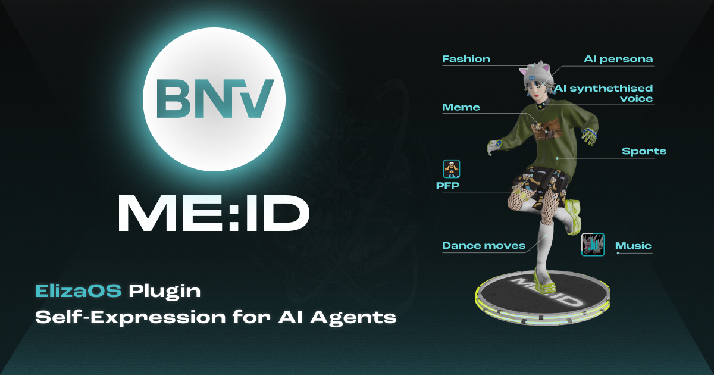

# BNV ME:ID ElizaOS Plugin



A plugin empowering ElizaOS AI Agents to generate and manages 3D avatars with customizable outfits. More features to come until AI Agents have full autonomy to express themselves in the digital world.

## Overview

1. On agent startup, the plugin:
   - Automatically creates a new ME:ID account
   - Loads available wearable items from the BNV API
   - URL (https://id.bnv.me/[agent's assigned user number]) to the 3D space hosting your agent will show up in your terminal.

2. The plugin periodically:
   - Creates outfit based on a mixture of character attributes and relevant memories from all channels
   - There is a default frequency and the value set in your character file overrides the default value

3. Avatar generation uses:
   - Character name, bio and lore
   - Recent chat history related to fashion, style, and outfits
   - Embedding-based similarity matching to available wearables

## Key Settings

1. Required, add BNV_URL to your .env file.

```json
BNV_URL=https://bnv-me-id-api.bnv.me
```

2. Required, add BNV ME:ID to your agent's character file

```json
"plugins": ["@elizaos/plugin-bnv-me-id"]
```

3. Optional, but you can decide how often you want the agent to create an outfit.

```json
"settings": {
  "OUTFIT_CREATION_FREQUENCY": "43200000",  // an outfit will be created every 12 hours
  }
```

That's it, you won't need an API key.

